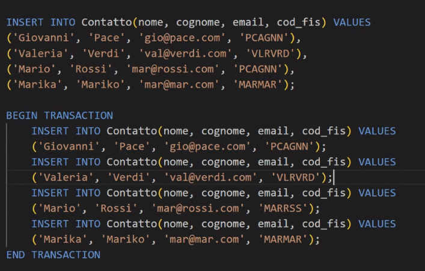

## Quali sono i tipi di dati più comuni utilizzati in SQL?
I tipi di dati più comuni utilizzati in SQL includono:

INTEGER: Un numero intero senza una parte decimale.

FLOAT: Un numero con una parte decimale. La precisione può variare.

VARCHAR(n): Una stringa di caratteri di lunghezza variabile. “n” rappresenta la lunghezza massima.

CHAR(n): Una stringa di caratteri di lunghezza fissa. “n” rappresenta la lunghezza.

BOOLEAN: Un valore booleano che può essere vero, falso o sconosciuto.

DATE: Una data.

TIME: Un orario.

DATETIME: Una data e un orario.

## Come inserire dati in una tabella SQL utilizzando la query INSERT

Per inserire dati in una tabella SQL, puoi utilizzare la query INSERT. Ecco un esempio di come si può fare:

<h3>Operazione INSERT</h3>
INSERT INTO Studenti (ID, Nome, Cognome, Età)
VALUES (1, 'Mario', 'Rossi', 20);

Questa query inserirà un nuovo record nella tabella Studenti con ID 1, Nome ‘Mario’, Cognome ‘Rossi’ e Età 20. Ricorda che i valori devono essere del tipo di dato corretto per la colonna specificata. Ad esempio, Età dovrebbe essere un numero intero, mentre Nome e Cognome dovrebbero essere stringhe.

## Come modificare i dati esistenti in SQL utilizzando la query UPDATE?

<h3>Operazione Upadate </h3>
TABELLA STUDENTE

UPDATE Studenti

SET Età = 21

WHERE ID = 1;

Questa query modificherà l’età dello studente con ID 1 a 21 nella tabella Studenti

## Come eliminare i dati da una tabella SQL utilizzando la query delete?

<h3> Operazione Delete </h3>
Per eliminare i dati da una tabella SQL, puoi utilizzare il comando DELETE. Questo comando rimuove i dati dalla tabella, ma non elimina la tabella stessa dal database.

DELETE senza filtro WHERE:
Se desideri cancellare tutti i dati dalla tabella indiscriminatamente, puoi utilizzare la seguente sintassi:
DELETE FROM nome_tabella;

DELETE con filtro WHERE:
Per una cancellazione più selettiva, puoi utilizzare la clausola WHERE per specificare un criterio. Ad esempio, per cancellare tutti i libri dalla tabella “libri” che non sono più disponibili, puoi fare così:
DELETE FROM libri WHERE disponibile = 0;

Puoi anche combinare più parametri condizionali utilizzando AND e/o OR per raffinare ulteriormente il criterio di cancellazione.

TRUNCATE:

Un altro comando SQL che svuota completamente la tabella è TRUNCATE:
TRUNCATE TABLE nome_tabella;

Con TRUNCATE, tutti i dati presenti nella tabella vengono eliminati in modo irreversibile.

## Come utilizzare la clausola WHERE per filtrare i risultati di una query SELECT?

La clausola WHERE è una parte fondamentale di SQL. Questa clausola filtra i risultati e applica condizioni alle query SQL. Viene utilizzata soprattutto insieme all’istruzione SELECT. Ecco alcune informazioni utili sulla clausola WHERE:

Sintassi di base:
La clausola WHERE viene posizionata dopo FROM e JOIN e prima di GROUP BY, HAVING e ORDER BY.

SELECT b.title, a.name, b.year

FROM books b

JOIN authors a ON b.author_id = a.id

WHERE b.year >= 2020

ORDER BY a.name;

Nota che abbiamo combinato le informazioni di due tabelle (books e authors) e abbiamo inserito la clausola WHERE dopo la condizione di unione (ON) e prima della clausola ORDER BY.

Operatori da utilizzare con SQL WHERE:

In WHERE è possibile creare condizioni di filtraggio molto semplici e complesse, grazie a un’ampia gamma di operatori che possono essere utilizzati per confrontare i valori in SQL.

Alcuni operatori comuni includono:
Confronto: =, !=, <, >, <=, >=.

BETWEEN: Per specificare un intervallo di valori.

IN: Per confrontare un valore con una lista di valori.

LIKE: Per cercare valori simili utilizzando caratteri jolly.

AND, OR, NOT: Per combinare condizioni.

Esempi:
quantity < 100
price BETWEEN 100 AND 500
customer_name = 'John Smith'

## Qual è la differenza tra INNERJOIN, LEFTJOIN,RIGHTJOIN in SQL?

In SQL, i JOIN sono utilizzati per combinare dati o righe provenienti da due o più tabelle in base a un campo comune tra di esse. Esistono diversi tipi di JOIN, ognuno con un comportamento specifico. Vediamo le differenze tra i principali tipi di JOIN:

<h3>INNER JOIN:</h3>
L’INNER JOIN restituisce le righe solo quando c’è una corrispondenza tra le tabelle coinvolte.
In altre parole, vengono incluse solo le righe che soddisfano la condizione di join specificata.

Esempio

SELECT account_id, name

FROM accounts

INNER JOIN customers ON accounts.customer_id = customers.
customer_id;

Questa query restituirà solo i conti bancari che hanno un cliente associato.

<h3>LEFT JOIN (o LEFT OUTER JOIN):</h3>

Il LEFT JOIN restituisce tutte le righe della tabella  di sinistra, prende gli elementi in comune , anche se non ci sono corrispondenze nella tabella di destra.
Se non c’è una corrispondenza, i valori della tabella di destra saranno NULL.

Esempio 

SELECT account_id, name

FROM accounts

LEFT JOIN customers ON accounts.customer_id = customers.customer_id;

Questa query restituirà tutti i conti bancari, inclusi quelli senza un cliente associato.

<h3>RIGHT JOIN (o RIGHT OUTER JOIN):</h3>

Il RIGHT JOIN è simile al LEFT JOIN, ma restituisce tutte le righe della tabella di destra, anche se non ci sono corrispondenze nella tabella di sinistra.
Anche qui, i valori della tabella di sinistra saranno NULL se non c’è una corrispondenza.

Esempio

SELECT account_id, name

FROM accounts

RIGHT JOIN customers ON accounts.customer_id = customers.customer_id;

Questa query restituirà tutti i clienti, inclusi quelli senza un conto bancario associato.

<h3>FULL JOIN (o FULL OUTER JOIN):</h3>

Il FULL JOIN restituisce tutte le righe da entrambe le tabelle, indipendentemente dalle corrispondenze.
Se non c’è una corrispondenza, i valori saranno NULL da entrambe le tabelle.

Esempio

SELECT account_id, name

FROM accounts

FULL JOIN customers ON accounts.customer_id = customers.customer_id;

Questa query restituirà sia i conti che i clienti, inclusi quelli senza corrispondenze.

## Quali sono le funzioni di aggregazione comuni in SQL e come utilizzarle?

Le funzioni di aggregazione in SQL sono utilizzate per calcolare valori aggregati da un insieme di dati. Ecco alcune delle funzioni di aggregazione più comuni e come utilizzarle:

<h3>MIN():</h3>
Restituisce il valore minimo all’interno di una colonna selezionata.

Ad esempio:
SQL

SELECT MIN(price) FROM products;
Questa query restituirà il prezzo più basso tra tutti i prodotti.

<h3>MAX():</h3>
Restituisce il valore massimo all’interno di una colonna selezionata.

Ad esempio:
SQL

SELECT MAX(salary) FROM employees;

Questa query restituirà la retribuzione più alta tra tutti gli impiegati.

<h3>COUNT():</h3>

Restituisce il numero di righe in un insieme.
Ad esempio:

SQL

SELECT COUNT(*) FROM orders;

Questa query restituirà il numero totale di ordini presenti nella tabella “orders”.

<h3>SUM():</h3>
Restituisce la somma totale di una colonna numerica.

Ad esempio:
SQL

SELECT SUM(quantity) FROM sales;

Questa query restituirà la somma di tutte le quantità vendute.

<h3>AVG():</h3>
Restituisce la media di una colonna numerica.
Ad esempio:

SQL

SELECT AVG(rating) FROM reviews;

Questa query restituirà la valutazione media tra tutte le recensioni.

ESEMPIO Selezionari i singoli negozi hai usato DISTINCT

## Come utilizzare la clausola HAVING per filtrare i risultati dopo aver utilizzato GROUP BY?

La clausola HAVING in SQL è utilizzata per filtrare i risultati dopo aver applicato la clausola GROUP BY. Vediamo come funziona e come utilizzarla:

Cos’è la clausola HAVING?

La clausola HAVING filtra i dati in base a criteri definiti.
È comunemente usata per creare rapporti basati su valori aggregati.
Si utilizza solo in una query SELECT.

Funziona in combinazione con la clausola GROUP BY.

Sintassi di HAVING:

La clausola HAVING viene posizionata dopo le clausole WHERE e GROUP BY, ma prima della clausola ORDER BY.

Esempio

SELECT column_list

FROM table_name

WHERE where_conditions

GROUP BY column_list

HAVING having_conditions

ORDER BY order_expression;

## Qual è lo scopo delle chiavi primarie e delle chiavi esterne in SQL?

Le chiavi primarie e le chiavi esterne sono concetti fondamentali nel design di database relazionali. Vediamo il loro scopo:

<h3>Chiave Primaria (Primary Key):</h3>
La chiave primaria è un attributo o un insieme di attributi che identifica univocamente ogni riga in una tabella.

Scopo:

Garantire l’univocità delle righe.
Fornire un riferimento stabile per collegare tabelle correlate.

Caratteristiche:
Deve contenere valori univoci per ogni riga.
Non può contenere valori NULL.
Di solito è composta da uno o più campi.

Esempio:
In una tabella “studenti”, l’attributo “matricola” potrebbe essere la chiave primaria.

<h3>Chiave Esterna (Foreign Key):</h3>

La chiave esterna è un attributo o un insieme di attributi che collega una tabella a un’altra.

Scopo:
Creare relazioni tra tabelle.
Mantenere l’integrità referenziale.
Caratteristiche:
Deve fare riferimento alla chiave primaria di un’altra tabella.
Può contenere valori NULL (se l’associazione è opzionale).

Esempio:
In una tabella “ordini”, l’attributo “cliente_id” potrebbe essere una chiave esterna che fa riferimento alla chiave primaria “id” nella tabella “clienti”.

In sintesi, la chiave primaria identifica univocamente le righe all’interno di una tabella, mentre la chiave esterna collega tabelle diverse per creare relazioni significative nel database. 

## Cos'è l'indice in SQL e perché è importante?

Gli indici in SQL sono strumenti essenziali per ottimizzare le prestazioni delle query e migliorare l’efficienza delle operazioni di ricerca nei database. Vediamo cosa sono e perché sono importanti:

<h4>Cosa sono gli indici e a cosa servono?</h4>

Un indice in una tabella agisce come un indice di un libro, ordinando i record del database in base al valore di un determinato campo.

Quando si esegue una query, il DBMS consulta prima l’indice per individuare le righe corrispondenti, rendendo la ricerca molto più veloce rispetto a una scansione completa della tabella.

<h4>Gli indici servono a:</h4>

Migliorare le prestazioni delle query.
Garantire l’univocità dei record tramite chiavi primarie.
Facilitare l’ordinamento dei dati.

<h4>Tipi di indici in SQL:</h4>

Chiave primaria (Primary Key): Associata alla chiave primaria della tabella, garantisce unicità e spesso viene utilizzata per identificare i record.

Chiave unica (Unique Key): Aggiuntiva rispetto alla chiave primaria, impedisce duplicati ma consente valori NULL.

Indice generico (Index): Consente duplicati e valori NULL.

Full Text: Specifico per la ricerca di parole all’interno dei testi.

## Cos'è la normalizzazione del database e perché è importante?

La normalizzazione del database è una tecnica fondamentale nella progettazione di database relazionali. Ecco cosa significa e perché è importante:

<h3>Definizione della normalizzazione:</h3>

La normalizzazione è una strategia che riduce la ridondanza dei dati e elimina anomalie come problemi di inserimento, aggiornamento e cancellazione.
Le regole di normalizzazione suddividono tabelle più grandi in tabelle più piccole e le collegano tramite relazioni.

<h3>Scopo e importanza:</h3>

Efficienza: La normalizzazione migliora le prestazioni delle query, consentendo ricerche più rapide e ottimizzando l’accesso ai dati.

Integrità dei dati: Riduce la possibilità di errori e inconsistenze nei dati.

Struttura logica: Garantisce che i dati siano archiviati in modo coerente e logico.

## Cos'è una transazione in SQL e quali sono le proprietà ACID?

<h3>Una transazione </h3>

in SQL rappresenta un’operazione che viene eseguita come singola unità di lavoro, garantendo che venga completata interamente o non venga eseguita affatto. 

ESEMPIO:

Le transazioni sono fondamentali per la gestione coerente dei dati nei database. Ora, esploriamo le proprietà ACID associate alle transazioni:

<h3>Proprietà ACID:</h3>

L’acronimo ACID rappresenta quattro proprietà chiave che definiscono una transazione:

<h3>Atomicità</h3> Ogni dichiarazione all’interno della transazione (lettura, scrittura, aggiornamento o cancellazione dei dati) viene gestita come singola unità. Se l’operazione non può essere eseguita completamente, non viene eseguita affatto. Questo previene la perdita o la corruzione dei dati.

<h3>Coerenza</h3> Le transazioni apportano modifiche alle tabelle solo in modo prevedibile e predefinito. La coerenza garantisce che gli errori nei dati non abbiano conseguenze indesiderate sull’integrità della tabella.

<h3>Isolamento</h3> Quando più utenti leggono e scrivono contemporaneamente sulla stessa tabella, l’isolamento delle transazioni assicura che non interferiscano tra loro. Ogni richiesta viene gestita come se fosse l’unica, anche se in realtà sono in corso molteplici transazioni simultaneamente.

<h3>Durabilità</h3> Le modifiche ai dati apportate da transazioni eseguite con successo vengono salvate, anche in caso di guasto del sistema.

<h4>Importanza delle transazioni ACID </h4>

Affidabilità: Le transazioni ACID garantiscono il massimo livello di affidabilità e integrità dei dati.

Prevenzione di situazioni di incoerenza: Senza transazioni ACID, interruzioni improvvise (come blackout elettrici) potrebbero lasciare il database in uno stato di incoerenza.

Ripristino facilitato: Le transazioni ACID semplificano il ripristino in caso di errori o guasti.

## Come utilizzare le istruzione COMMIT e ROLLBACK per gestire le transizioni in SQL?

Le istruzioni COMMIT e ROLLBACK sono fondamentali per gestire le transazioni in SQL. Vediamo come usarle:

<h3>COMMIT</h3>

L’istruzione COMMIT viene utilizzata per salvare tutte le modifiche apportate da una transazione.
Quando esegui un COMMIT, le modifiche dalla transazione corrente vengono permanentemente salvate nel database.

Esempio
DELETE FROM Customer WHERE State = 'Texas';

COMMIT;

Questo comando cancellerà la riga con “State” uguale a “Texas” e salverà la modifica.

<h3>ROLLBACK</h3>

L’istruzione ROLLBACK viene utilizzata per annullare le modifiche apportate da una transazione.

Se esegui un ROLLBACK, tutte le modifiche dalla transazione corrente vengono annullate.

Esempio
DELETE FROM Customer WHERE State = 'Texas';

ROLLBACK;

Questo comando cancellerà la riga con “State” uguale a “Texas” senza salvarla.

Importante:

COMMIT rende le modifiche permanenti.
ROLLBACK annulla le modifiche.

## Qual è lo scopo dei trigger in SQL e come crearne uno?
I trigger in SQL sono frammenti di codice che vengono eseguiti automaticamente in risposta a eventi specifici che si verificano su una tabella nel database. Vediamo come crearne uno:

Scopo dei trigger:
I trigger servono a:
Rispondere automaticamente a eventi come INSERT, UPDATE o DELETE su una tabella.

Eseguire azioni specifiche quando si verificano determinati eventi.

Mantenere l’integrità dei dati e automatizzare operazioni comuni.

Sintassi per creare un trigger:

<h3>Utilizziamo l’istruzione CREATE TRIGGER</h3>

CREATE TRIGGER nome_trigger [BEFORE | AFTER] evento

ON nome_tabella

PER tipo_trigger

BEGIN
    -- logica del trigger

END;

Vediamo i dettagli:

nome_trigger: Specifica il nome del trigger.

BEFORE o AFTER: Determina quando il trigger viene eseguito rispetto all’evento (ad esempio, prima o dopo un’operazione di inserimento, aggiornamento o cancellazione).

evento: Indica l’operazione che attiva il trigger (ad esempio, INSERT, UPDATE o DELETE).

nome_tabella: Specifica la tabella associata al trigger.

tipo_trigger: Può essere FOR EACH ROW (trigger di livello riga) o FOR EACH STATEMENT (trigger di livello istruzione).

## Cos'è una stored procedure in SQL e come crearla?

Una stored procedure in SQL è un gruppo di istruzioni SQL raggruppate in un modulo e memorizzate nel database per un utilizzo successivo. Le stored procedure sono utili per automatizzare operazioni comuni, migliorare le prestazioni delle query e mantenere l’integrità dei dati.

Esempio di creazione di una stored procedure:

Supponiamo di voler creare una stored procedure che restituisca tutti i clienti da una tabella “Customers”:

CREATE PROCEDURE SelectAllCustomers

AS

SELECT * FROM Customers;

Questa stored procedure seleziona tutti i record dalla tabella “Customers”

Esecuzione della stored procedure:

Per eseguire la stored procedure,

 utilizza l’istruzione EXEC:
EXEC SelectAllCustomers;

Questo eseguirà la stored procedure e restituirà i risultati

In breve, le stored procedure semplificano la gestione delle query complesse e migliorano l’efficienza delle operazioni nel database.

## Tipicamente quante tabelle ci sono in una relazione One To Many?

In una relazione One-to-Many, tipicamente ci sono due tabelle coinvolte:

<h3>Tabella “One” (Tabella genitore)</h3>
Questa tabella rappresenta il lato “uno” della relazione.
Contiene un record per ciascuna entità principale.

Ad esempio, se stiamo modellando una relazione tra “Clienti” e “Ordini”, la tabella “Clienti” sarebbe il lato “uno”.

<h3>Tabella “Many” (Tabella figlio)</h3>
Questa tabella rappresenta il lato “molti” della relazione.
Contiene uno o più record associati a ciascun record nella tabella “One”.

Utilizza una chiave esterna per collegarsi alla tabella “One”.
Nell’esempio sopra, la tabella “Ordini” sarebbe il lato “molti”.

In breve, una relazione One-to-Many coinvolge due tabelle, con una tabella che rappresenta il lato “uno” e l’altra il lato “molti”

## Tipicamente quante tabelle ci sono in una relazione Many To Many?

In una relazione Many-to-Many, tipicamente ci sono tre tabelle coinvolte:

<h3>Tabella “Uno” (Tabella genitore)</h3>
Questa tabella rappresenta il lato “uno” della relazione.
Contiene un record per ciascuna entità principale.
Ad esempio, se stiamo modellando una relazione tra “Studenti” e “Corsi”, la tabella “Studenti” sarebbe il lato “uno”.

<h3>Tabella di collegamento (Junction Table o Tabella di associazione):</h3>
Questa tabella funge da ponte tra le tabelle “Uno” e “Molti”.
Contiene le chiavi esterne delle tabelle coinvolte.
La sua struttura consente di collegare i record tra le tabelle.

Nell’esempio sopra, questa tabella conterrà le chiavi esterne degli studenti e dei corsi.

<h3>Tabella “Molti” (Tabella figlio):</h3>
Questa tabella rappresenta il lato “molti” della relazione.
Contiene uno o più record associati a ciascun record nella tabella di collegamento.
Utilizza una chiave esterna per collegarsi alla tabella di collegamento.

Nell’esempio sopra, la tabella “Corsi” sarebbe il lato “molti”.

In sintesi, una relazione Many-to-Many coinvolge tre tabelle: la tabella “Uno”, la tabella di collegamento e la tabella “Molti”.

## Tipicamente quante tabelle ci sono in una relazione One To One?

In una relazione One-to-One, tipicamente ci sono due tabelle coinvolte:

<h3>Tabella “Uno” (Tabella genitore):</h3>
Questa tabella rappresenta il lato “uno” della relazione.
Contiene un record per ciascuna entità principale.
Ad esempio, se stiamo modellando una relazione tra “Clienti” e “Ordini”, la tabella “Clienti” sarebbe il lato “uno”.

<h3>Tabella “Molti” (Tabella figlio):</h3>
Questa tabella rappresenta il lato “molti” della relazione.
Contiene uno o più record associati a ciascun record nella tabella “Uno”.

Utilizza una chiave esterna per collegarsi alla tabella “Uno”.
Nell’esempio sopra, la tabella “Ordini” sarebbe il lato “molti”.

In sintesi, una relazione One-to-One coinvolge due tabelle: una tabella che rappresenta il lato “uno” e un’altra tabella che rappresenta il lato “molti”.

