## TYPESCRIPT
typescript: superset di funzioni per limitare javascript e renderlo piu type safe
e un linguaggio compilato in input scritto con typescript e in output con javascript 
non ce l'esecuzione diretta dei file con estensione typescript 

SET [] e un operazione che non permette ripetizioni ma prendi tutte le tipologie di dato 

PROTOTYPE [] indica la tipologia del dato passato 

inferenza del generico tipo quando dichiari la tipologia del dato che passi 

node.js e un sistema che ci permette di eseguire javascript

CLI command line interface ci lavora visual studio code

WEB RENDER E V8 sul primo si esegue l'HTML nel secondo JS

function e un metodo che non ha una classe di appartenenza

### Dependency Injection
La dependency injection è un principio di progettazione nel quale le dipendenze di un oggetto vengono fornite da un'esterna, invece di crearle internamente. Serve per rendere il codice più modulare, manutenibile e testabile, permettendo di configurare e sostituire le dipendenze senza modificare direttamente il codice dell'oggetto che le utilizza.

La Dependency Injection è utile per migliorare la modularità e la manutenibilità del codice, riducendo la complessità delle dipendenze tra i vari componenti del sistema. Inoltre, permette di cambiare le dipendenze in fase di runtime piuttosto che in fase di compilazione. Questo rende il codice più flessibile e facilita la sostituzione o l’aggiornamento dei componenti.

si puo iniettare solo tramite il costruttore 

### Firma del metodo 
La firma del metodo rappresenta la sua struttura dichiarativa, includendo il nome del metodo, il tipo di ritorno, i parametri e le eccezioni che possono essere lanciate. Serve per definire l'interfaccia esterna di un metodo, specificando come può essere chiamato e utilizzato all'interno del codice. La firma del metodo facilita la comprensione e la corretta implementazione delle interfacce di programmazione

### Vincolo d'entità referenziale
Il vincolo di entità referenziale (foreign key constraint) è una regola nei database relazionali che garantisce l'integrità referenziale tra due tabelle. Serve per garantire che ogni valore in una colonna (chiave esterna) di una tabella corrisponda a un valore valido in un'altra tabella (chiave primaria). Ciò assicura coerenza e consistenza dei dati tra le tabelle, evitando riferimenti a entità inesistenti.

terminali windows sono command e powershell 
### variabili d'ambiente

Le variabili d'ambiente sono valori dinamici memorizzati dal sistema operativo e accessibili da tutti i processi in esecuzione. Vengono utilizzate per configurare il comportamento dei programmi, definendo percorsi di ricerca, impostazioni di lingua, chiavi di autenticazione e altro ancora.

* Path 

Il "path" (percorso) si riferisce a una variabile d'ambiente che elenca le cartelle in cui il sistema operativo cerca i programmi eseguibili quando si digita un comando nella riga di comando o si avvia un'applicazione. È un elenco di percorsi di directory separati da punti e usato per trovare ed eseguire rapidamente i programmi senza specificare il percorso completo.

## classe astratta
E UNA SITUAZIONE DI EREDITARIETA'
Una classe astratta è una classe in un linguaggio di programmazione che non può essere istanziata direttamente, ma fornisce un'interfaccia comune e definisce metodi CHE NON HANNO CORPO che le classi figlie devono implementare. Le classi astratte sono utilizzate per definire comportamenti comuni senza implementare dettagli specifici.

### esempi di polimorfismo 

Ecco alcuni esempi di polimorfismo:

Polimorfismo di metodo: Una stessa interfaccia di metodo può essere implementata in modi diversi dalle classi figlie. Ad esempio, una classe "Shape" può avere un metodo "draw" implementato in modo diverso per cerchi, quadrati e triangoli.

Polimorfismo di classe: Un'interfaccia può essere implementata in modi diversi da diverse classi. Ad esempio, diverse classi di animali (come "Dog", "Cat", "Bird") possono implementare un'interfaccia "Animal" con metodi come "makeSound".

Polimorfismo con overriding: Una classe figlia può sovrascrivere un metodo ereditato dalla classe genitore per modificarne il comportamento. Ad esempio, una classe "Car" può sovrascrivere il metodo "startEngine" ereditato dalla classe "Vehicle".

Polimorfismo con overloading: Metodi con lo stesso nome ma con firme diverse (parametri diversi) possono comportarsi in modo diverso. Ad esempio, una classe "Calculator" può avere un metodo "add" che può essere sovraccaricato per accettare diversi tipi di input (integers, floats, etc.).

Il polimorfismo consente al codice di essere più flessibile, mantenendo allo stesso tempo un'interfaccia comune per oggetti di diversi tipi.

* DEFINIZIONE  

Il polimorfismo è un concetto di programmazione in cui oggetti di diverse classi possono essere trattati con un'interfaccia comune, consentendo a metodi simili di comportarsi in modo diverso in base al tipo di oggetto che li chiama.

BINDING STATICO 

CLASSE ASTRATTA PERSONA
altre classi sono DOCENTE STUDENTE SEGRETARIO

esempio

Persona p = NEW docente() 

## LINQ

LINQ (Language Integrated Query) in C# è un insieme di funzionalità che permette di eseguire query direttamente nel codice C#. Consente di scrivere query leggibili e robuste per interrogare e manipolare dati da diverse fonti come collezioni, database SQL, XML, e altro ancora. LINQ offre un'astrazione potente per filtrare, ordinare e proiettare dati, migliorando l'efficienza e la chiarezza del codice.

## ORM

ORM (Object-Relational Mapping) è una tecnica per mappare oggetti di programmazione a tabelle di database relazionali. Automatizza l'interazione tra il codice e il database, consentendo operazioni CRUD (creazione, lettura, aggiornamento, cancellazione) utilizzando oggetti anziché SQL.

## DTO

DTO, acronimo di "Data Transfer Object", è un design pattern utilizzato nello sviluppo del software per rappresentare un oggetto che trasporta dati tra diversi sistemi o livelli di un'applicazione. Il suo scopo principale è quello di ottimizzare le prestazioni, riducendo il numero di chiamate tra il livello di presentazione e il livello di business.

Le caratteristiche principali di un DTO includono:

Trasporto dei dati: Un DTO è principalmente utilizzato per trasportare dati tra i diversi componenti di un'applicazione. Questi dati possono provenire da una sorgente di dati, come un database, e devono essere spediti a un'altra parte dell'applicazione, come l'interfaccia utente.

Semplicità: Un DTO dovrebbe essere semplice e contenere solo i dati necessari per una particolare operazione. Non dovrebbe contenere logica di business o comportamento.

Indipendenza dal dominio: I DTO sono spesso progettati per essere indipendenti dal modello di dominio sottostante. Ciò significa che la struttura dei DTO può essere ottimizzata per le esigenze specifiche di trasferimento dati senza essere vincolata alla struttura dei dati nel database o nella logica di business.

Serializzazione: Un DTO è progettato per essere facilmente serializzato in formati di dati comuni, come JSON o XML, per consentire la trasmissione dei dati su reti o tra sistemi distribuiti.

In sintesi, un DTO è un'astrazione dei dati progettata per semplificare lo scambio di informazioni tra i diversi componenti di un'applicazione. È ampiamente utilizzato in architetture software complesse per migliorare le prestazioni e la manutenibilità del codice.

## MIGRAZIONE

Una migrazione in ambito informatico è il processo di modifica dello schema di un database in modo controllato e automatizzato, permettendo la trasformazione dei dati da uno stato precedente a uno nuovo. Le migrazioni consentono di gestire modifiche strutturali del database nel tempo, mantenendo la coerenza dei dati e la reversibilità delle operazioni.

ESEMPIO 
tabella studente nome cognome matricola fai migrazione che aggiungi email ma se ti manca il dato nella tabella non funziona nell approccio code first 

nell approccio classico il database e gia compilato in maniera corretta , nella crezione dello scaffolding tramite entity framework crea la corretta correlazione alle tabelle 

## DIRETTIVA using
ti permette di utilizzare una variabile all' interno del contesto

## AGGREGAZIONE 
L'aggregazione è una relazione tra due classi o oggetti dove un'istanza di una classe (parte) è associata ad un'altra classe (intero) tramite un riferimento. La parte può esistere indipendentemente dall'intero e può essere condivisa tra più interi. Questa relazione è più debole della composizione e implica un'associazione "has-a".

esempio una scatola di penne esiste anche senza penne 

## COMPOSIZIONE
La composizione è una relazione tra due classi dove un'istanza di una classe (componente o parte) è parte integrante di un'altra classe (composito o intero). Il componente è strettamente legato al composito e normalmente non esiste al di fuori di esso. La composizione implica una forte relazione "part-of" e spesso l'intero gestisce il ciclo di vita dei suoi componenti. Se il composito viene distrutto, anche i suoi componenti vengono eliminati.

esempio un mazzo di fiori puo essere composto da uno o piu fiori 

## TYPE SAFE 
Il termine "type-safe" (sicurezza dei tipi) si riferisce a una caratteristica di un linguaggio di programmazione che impedisce operazioni non sicure o ambigue riguardanti i tipi di dati. In un linguaggio type-safe, le operazioni sono controllate a tempo di compilazione per garantire che i tipi di dati siano usati correttamente, riducendo così gli errori durante l'esecuzione del programma. Questo approccio migliora la robustezza, la chiarezza e la manutenibilità del codice.

Esempio C# e un linguaggio fortemente tipizzato
javascript no 

ESEMPIO
VIOLAZIONE DI DICHIARAZIONE CHE PUO SUCCEDERE mettendo VAR prima con un tipo intero poi con un tipo stringa 

## IENEMERAUBLE 
IEnumerable è un'interfaccia in C# che consente agli oggetti di essere enumerati, consentendo l'iterazione su una raccolta di dati. Gli oggetti che implementano IEnumerable possono essere utilizzati in cicli foreach e supportano le query LINQ.

## HASHTABLE
Una hash table è una struttura dati che memorizza le coppie chiave-valore, consentendo l'accesso rapido ai valori tramite un sistema di hashing. Le chiavi vengono convertite in indici tramite una funzione hash per la ricerca efficiente dei valori associati.

## DICTIONARY 
Un Dictionary in C# è una struttura dati generica che rappresenta una raccolta di coppie chiave-valore, dove ogni chiave è associata a un valore specifico. È simile a una hash table, consentendo l'accesso rapido ai valori tramite chiavi univoche. Le operazioni di inserimento, rimozione e ricerca sono efficienti. La classe Dictionary<TKey, TValue> fornisce metodi per aggiungere, rimuovere, cercare e recuperare elementi in base alle chiavi. È ampiamente utilizzata per la gestione di dati strutturati e associativi.

* DIFFERENZA

La differenza principale tra una hash table e un dictionary riguarda il contesto di utilizzo e le caratteristiche specifiche implementate nelle rispettive classi.

Hash Table:

Una hash table è una struttura dati generale che memorizza coppie chiave-valore.
Utilizza una funzione hash per convertire le chiavi in indici (posizioni) all'interno della struttura dati.

Può essere implementata in molti linguaggi di programmazione e può avere varie implementazioni, come array associativi, tabelle hash con concatenamento o indirizzamento aperto, ecc.

Non sempre fornisce caratteristiche avanzate come metodi di aggiunta, rimozione o ricerca ottimizzati.

Spesso richiede una gestione manuale della risoluzione delle collisioni.

Dictionary in C#:

In C#, Dictionary<TKey, TValue> è una struttura dati specifica implementata come parte delle collezioni generiche.

È una implementazione specifica di una hash table ottimizzata per le prestazioni.

Utilizza una funzione hash per memorizzare e recuperare rapidamente i valori associati alle chiavi.

Fornisce metodi ben definiti e ottimizzati per l'aggiunta, la rimozione e la ricerca di elementi in base alle chiavi.

Gestisce automaticamente le collisioni e altri aspetti dell'implementazione della hash table.

È altamente ottimizzata per le prestazioni e offre una vasta gamma di funzionalità, inclusa la compatibilità con LINQ (Language-Integrated Query) per interrogare e manipolare i dati.

In sintesi, una hash table è un concetto più generico e può riferirsi a diverse implementazioni di tabelle hash in vari linguaggi di programmazione. D'altra parte, in C#, il termine "Dictionary" si riferisce specificamente alla classe Dictionary<TKey, TValue> che è una hash table ottimizzata e integrata nel framework .NET con funzionalità avanzate e prestazioni ottimizzate per la gestione efficiente delle coppie chiave-valore.

 ### CLASSE WRAPPER
Una classe "wrapper" in TypeScript è una classe che incapsula un'altra classe o tipo di dati, aggiungendo funzionalità o comportamenti aggiuntivi senza modificarne direttamente l'implementazione. Viene utilizzata per estendere o decorare funzionalità esistenti in modo flessibile e modulare.

### CASTING
Il "casting" è una conversione esplicita di un tipo di dato in un altro tipo compatibile. Viene utilizzato per cambiare il tipo di una variabile o espressione, permettendo operazioni tra tipi diversi. Il casting può essere sicuro o insicuro, a seconda del linguaggio e della compatibilità dei tipi.

## SCOPE 
Lo "scope" in programmazione e un contetsto che permette la disponibilità di variabili, funzioni o altri identificatori in una parte specifica del codice. Lo scope determina dove un identificatore può essere utilizzato e acceduto all'interno del programma. Tipi comuni di scope includono:

Global Scope: Variabili definite globalmente sono accessibili da qualsiasi parte del programma.

Local Scope: Variabili definite all'interno di una funzione sono accessibili solo all'interno di quella funzione (scope locale).

Scope di Blocco: In linguaggi come JavaScript, variabili definite con let o const hanno scope di blocco, limitato all'interno delle parentesi {} dove sono state definite.

Lo scope aiuta a prevenire conflitti di nomi e a gestire la visibilità delle variabili, contribuendo alla chiarezza e alla manutenibilità del codice.

HHTP REQUEST lo standard utilizzato era lo XML 

AJAX nasconde l'HTTP REQUEST e in javascript la utilizzi per fare le chiamate asincrone
ora utilizzi le FETCH che funzionano con le PROMISE

 ## FETCH
In programmazione web, fetch è un metodo JavaScript utilizzato per effettuare richieste HTTP asincrone verso risorse di rete, come API REST. Restituisce una Promise che risolve con l'oggetto Response contenente i dati ottenuti dalla richiesta. fetch supporta diverse opzioni per configurare la richiesta, come il metodo HTTP, i parametri, le intestazioni e altro ancora. È ampiamente utilizzato per interagire con server remoto e recuperare dati in modo asincrono nel web moderno.

## PROMISE 
Una Promise in JavaScript rappresenta il risultato di un'operazione asincrona, che può essere in uno dei tre stati: pending (in attesa), fulfilled (risolta con successo) o rejected (fallita). Le Promises consentono di gestire flussi di codice asincrono in modo più pulito e leggibile, facilitando la gestione degli errori tramite then() e catch().

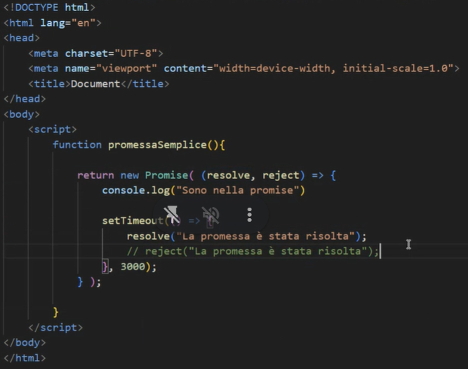

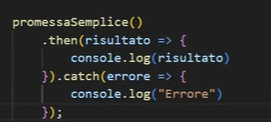

## ANGULAR

quando e stato rilasciato usava il linguaggio javascript  VERSIONE ANGULAR 2 dalle successive usa TypeScript

SSR SERVER SIDE RENDERING 

viene caricato nel browser 

E FORMATO DA COMPONENTI 

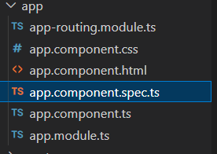

ANGULAR ha un approccio STATEFUL 

Angular è un framework open-source per lo sviluppo di applicazioni web e mobile, basato su TypeScript. Utilizza un'architettura stateful per gestire lo stato dell'applicazione in modo efficiente, consentendo la creazione di interfacce utente dinamiche e reattive.

ogni javascript che lui usa viene mimificato

all'avvio cerca sempre un entry point che e approute

app.module.ts e un filtro ha un elenco di tutte le componenti che ha bisogno la mia applicazione 

per inizializzare un componente ng generate component nome componente 

ng serve per avviare il server 

metodo ngOnInit

Il metodo ngOnInit() in Angular è un lifecycle hook che viene chiamato una volta che il componente è stato inizializzato. È utilizzato per eseguire operazioni di inizializzazione come chiamate a servizi per ottenere dati iniziali o per configurare lo stato del componente.

INJECTION

 innietto una proprieta per autorizzare l'operazione devi passare dal provider che sta all'interno del app.module.ts

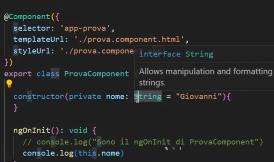        

CREAZIONE PROGETTO

ricordati che devi farlo sul cmd

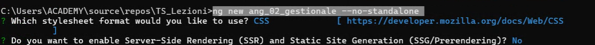

CREAZIONE DI UNA CLASSE

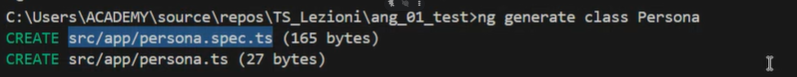

le componenti vanno richiamati qui
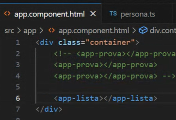

CREAZIONE DI UN ELENCO 

CREAZIONE DI UNA TABELLA

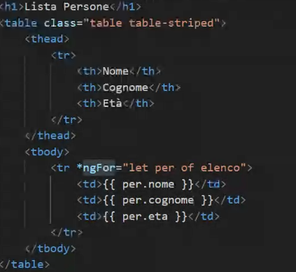

se usi la funzione timeout

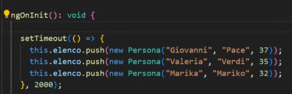

CREAZIONE DEL MODELLO E DEL SERVIZIO

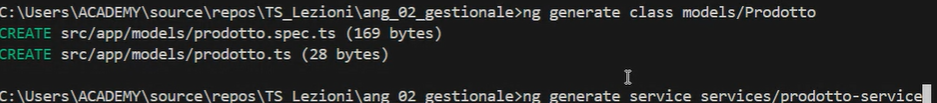

CREAZIONE LISTA 

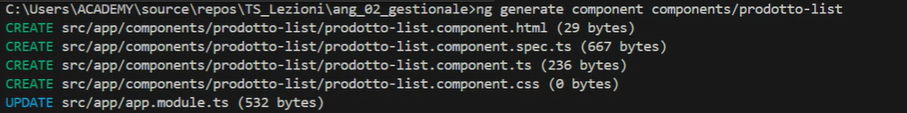

ROTTE

chiave e indirizzo 

valore e il componente che ti serve 

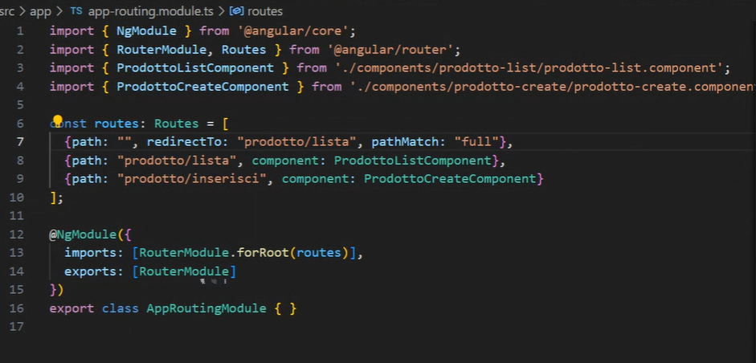

CREAZIONE DELLA NAVBAR

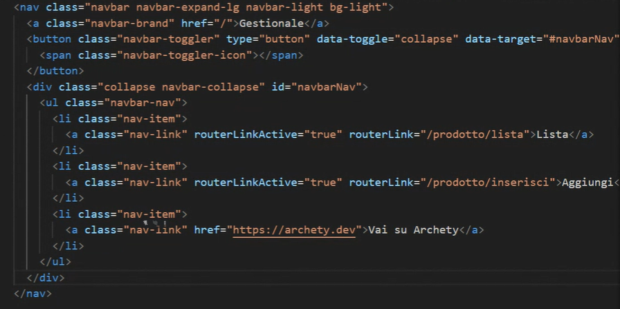
    
## AJAX
e una funzionalità che fa parte della libreria jquery

ajax e una richiesta asincrona è un metodo in JavaScript per inviare richieste asincrone a un server web senza dover ricaricare l'intera pagina. Utilizza l'oggetto XMLHttpRequest o, più recentemente, il metodo fetch per comunicare con il server e ottenere dati in background. Questo consente agli sviluppatori di creare esperienze web più fluide e interattive, caricando o aggiornando contenuti dinamicamente senza interruzioni per l'utente.

OBSERVABLE una variabie che guarda finche non si popola

CREAZIONE PROGETTO TYPESCRIPT SCALETTA

1) ti crei prima le classi con i rispettivi attributi mettondo export class e nome della classe {}
con l'aggregazione la lista esiste guarda esempio su classe utente 

per uuid c'è l'npm js e prima di installarlo fai npm init cosi ti crea il packagelock.json poi ti porto dentro l'import dove devi utilizzarla 

la funziona parametrica su angular nel componetente di riferimento viene esplicitato con i :

## STATE-FULL

"Stateful" (o "state-full") si riferisce a un sistema o a un'applicazione che mantiene uno stato o una memoria delle informazioni sull'interazione corrente con un utente o su uno specifico contesto. In un contesto informatico, un'applicazione stateful mantiene dati sullo stato tra le richieste degli utenti, consentendo di gestire sessioni e mantenere informazioni specifiche per l'utente o per l'applicazione stessa. Questo è in contrasto con un'applicazione "stateless" che tratta ogni richiesta in modo isolato, senza mantenere informazioni sullo stato tra le richieste.

## INFORMATION HIDING

L'information hiding (o incapsulamento dell'informazione) è un principio di progettazione del software che consiste nel nascondere i dettagli di implementazione di una classe o di un modulo, esponendo solo le funzionalità essenziali attraverso un'interfaccia ben definita. Questo approccio consente di proteggere i dettagli interni e di limitare l'accesso diretto agli stati e ai comportamenti interni di un oggetto. Ciò favorisce la modularità, la manutenibilità e la sicurezza del codice, consentendo di modificare l'implementazione interna senza influenzare gli altri componenti del sistema.

## OVERLOAD
L'overload è un concetto di programmazione che consente di definire più metodi o funzioni con lo stesso nome all'interno di una classe, ma con firme diverse (cioè con diversi tipi di parametri o numeri di parametri). Il compilatore riconosce automaticamente quale versione del metodo chiamare in base ai tipi o al numero dei parametri passati. Questa tecnica consente di fornire un'interfaccia intuitiva e flessibile per utilizzare funzioni simili con comportamenti specifici in base al contesto.

## REST-FULL
RESTful (Representational State Transfer) è un'architettura per la progettazione di servizi web che si basa sui principi fondamentali di REST. Un servizio RESTful utilizza HTTP per trasferire dati e si concentra sul concetto di risorse identificate da URI. Utilizza i metodi standard HTTP (come GET, POST, PUT, DELETE) per eseguire operazioni CRUD (Create, Read, Update, Delete) sulle risorse. Inoltre, adotta i concetti di statelessness e caching per migliorare le prestazioni e la scalabilità dei servizi. Un'API RESTful offre un'interfaccia uniforme e scalabile per l'accesso e la manipolazione delle risorse tramite richieste HTTP ben definite.

